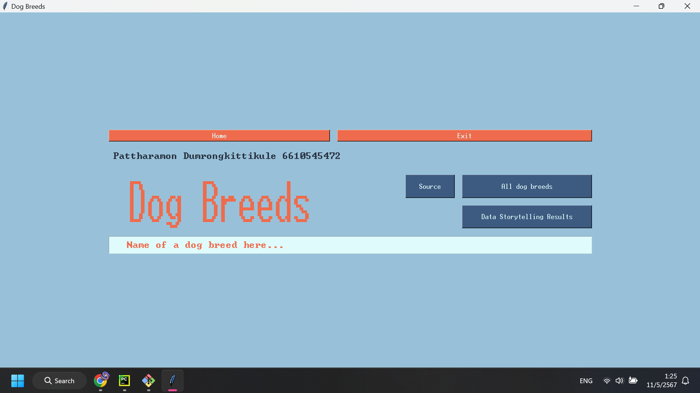
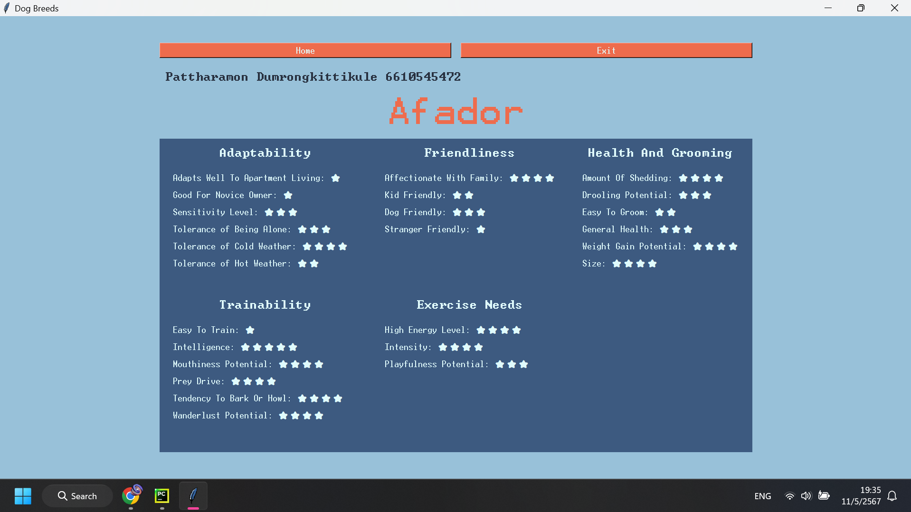
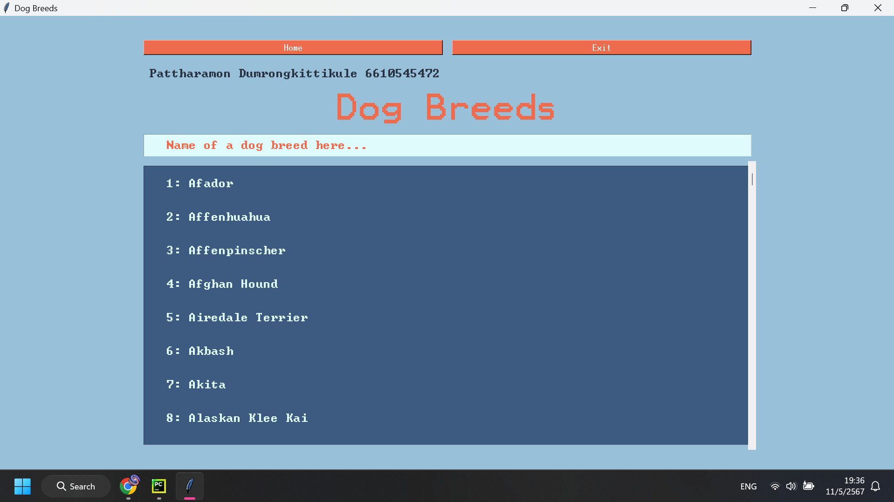
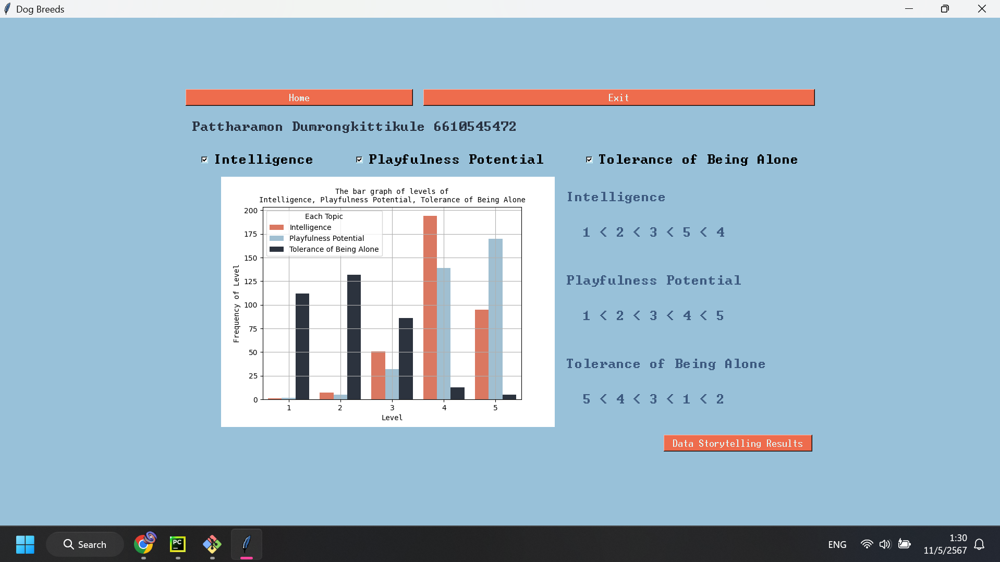
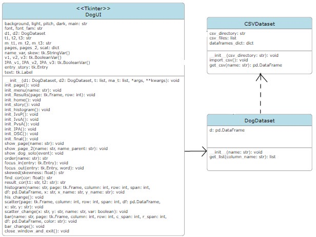
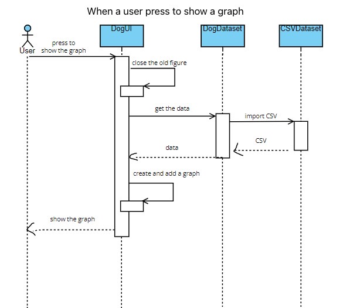

# Dog_Breeds
The Year Project of Programming II, Pattharamon Dumrongkittikule 6610545472

---
- Dog Breeds

- An application giving information about dog breeds. The topic is about the relationship between Intelligence, Playfulness Potential, and Tolerance of Being Alone.

- Screenshots of the application:
  - 
  - 
  - 
  - 
  - 
  - 
  - 
  - 
  - 

- How to install and run the program:
  - Clone the repository 
    - git clone https://github.com/Pat-7-626/Dog_Breeds.git
  - Change your directory to Dog Breeds
    - cd Dog_Breeds
  - Create a virtual environment: 
    - python -m venv env
  - Install all requirements.txt
    - pip install -r requirements.txt
  - Run the program
    - python main.py

- [References to project documents and diagrams](https://github.com/Pat-7-626/Dog_Breeds/wiki):
  - [Project Proposal](https://docs.google.com/document/d/1Hju99xpqybrFhszkwQ9JbiWFZMbAnn7UyQlbgP3flAk/edit?usp=sharing)
  - [Development Plan](https://github.com/Pat-7-626/Dog_Breeds/wiki/Development-Plan)
  - 
  - 

- The requirements 
  - pandas>=2.2.2
  - matplotlib>=3.8.3
  - scipy>=1.13.0
  - seaborn>=0.13.2

- [The source of the dataset](https://www.kaggle.com/datasets/mexwell/dog-breeds-dogtime-dataset)
---
